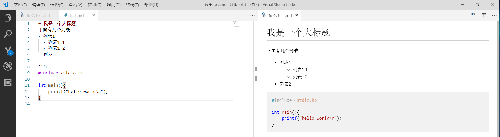

# Markdown
第一课当然是比较简单的，让大家了解一下 Markdown 这种语法。这是一种非常方便而且应用广泛的一种输入方式  
希望大家能够将该语法作为自己输入和记录的常用方法，自己做记录的时候~~尽量~~不要使用 Word  

# 工具
PC 端各个系统强烈推荐 [Visual Studio Code](https://code.visualstudio.com/)（简称 `VS Code`），点击 download 即可下载  
新建后缀为.md文件之后即可开始编写，右上角选择打开侧边预览即可看到效果  

<!-- 
  
  -->

# 教程
可以看一下 [Markdown常用语法](http://blog.cugxuan.cn/2017/05/05/Markdown/Markdown-Common-Syntax/)

# 要求
使用1小时的时间，了解常见的 Markdown 编辑方法，然后以后再使用的过程中慢慢熟悉  
以下较为重要的Markdown语法：
- 各级标题的输入
- 如何使用引用
- 如何对关键字进行加粗
- 如何引用图片和链接
- 如何编辑代码块
- 如何编辑简单表格(复杂表格使用 Markdown 并不友好)
- 如何编辑列表